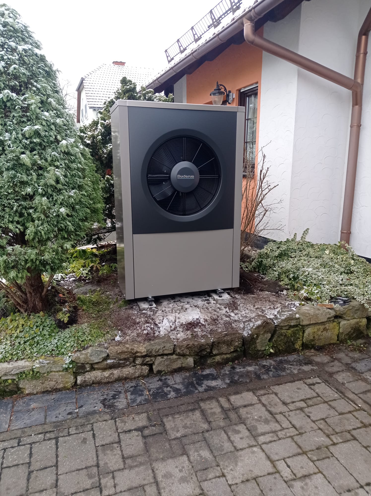

W&auml;rme und Heizung Jekat Ilmenau
===

> Lokal und vernetzt 

## Kontakt

 * Telefon oder WhatsApp:
 * Email: 

## Unser Angebot

Wir sind ein zertifizierter Heizungsbauerbetrieb in Ilmenau und seit &uuml;ber 30 Jahren im
Gesch&auml;ft. Wir bieten Ihnen

 * Auslegung, Auswahl und Einbau von W&auml;rmepumpen f&uuml;r Ihren Neubau oder
   Ihren Bestand
 * Transparente Preisgestaltung mit einem Blick f&uuml;r flexible und preiswerte L&ouml;sungen
 * Zusammenarbeit mit lokalen Handwerksbetrieben und dem Netzbetreiber
 * Unterst&uuml;tzung bei Beantragung und Abwicklung der F&ouml;rderung (bis zu 70%) &uuml;ber die [KfW](https://www.kfw.de/inlandsfoerderung/Privatpersonen/Bestehende-Immobilie/F%C3%B6rderprodukte/Heizungsf%C3%B6rderung-f%C3%BCr-Privatpersonen-Wohngeb%C3%A4ude-(458))

Vereinbaren Sie einen Termin und wir besprechen zeitnah und unverbindlich

 1. Welche W&auml;rmepumpe passt zu meinem Haus?
 2. Kann die bestehende Heizungsinstallation genutzt werden?
 3. Welche Ma&szlig;nahmen bis zur neuen Heizung?

## Abgeschlossene Projekte (Auswahl)

 * Ilmenau, Dezember 2024: Eine 11KW Buderus WLW196i f&uuml;r Heizung und Warmwasser als
   Ersatz f&uuml;r eine Gastherme in einem Zweifamilienhaus. Nur der
   Energietr&auml;ger wurde ausgetauscht -- die vorhandene Installation (Leitungen
   und Heizk&ouml;rper) war ausreichend und wurde einfach weiterverwendet.

   
